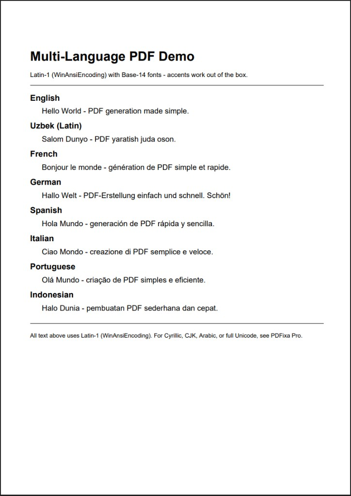

# pdfixa-examples

[](https://github.com/offixa/pdfixa-examples/actions)
[](LICENSE)
[](https://adoptium.net)

Code examples for [PDFixa](https://github.com/offixa/PDFixa) — a deterministic PDF generation library for Java.

---

## Getting Started

### Prerequisites

Make sure these are installed before you begin:

- **Java 17+** — check with `java -version`
- **Maven 3.8+** — check with `mvn -version`
- **Git** — check with `git --version`

### Step 1 — Clone this repository

```bash
git clone https://github.com/offixa/pdfixa-examples
cd pdfixa-examples
```

`pdfixa-core` is available on Maven Central — Maven will download it automatically.

### Step 2 — Run your first example

```bash
mvn -pl hello-world exec:java -Dexec.mainClass="example.HelloWorldExample"
```

You should see:

```
Saved: hello.pdf
```

Open `hello-world/hello.pdf` — you just generated your first PDF with PDFixa.

---

## Why PDFixa?

Most Java PDF libraries are either too low-level (you manage PDF operators directly) or too high-level (you feed a template engine and hope the layout is right). PDFixa sits in between: a plain Java API where you place content at exact coordinates, and the output is always the same.

| | PDFixa | iText | Apache PDFBox | OpenPDF |
|---|---|---|---|---|
| License | Apache 2.0 | AGPL / commercial | Apache 2.0 | LGPL |
| API style | Coordinate-based, simple | Powerful, complex | Low-level | iText 2 fork |
| Deterministic output | Yes | Depends on version | No guarantee | No guarantee |
| Template engine required | No | No | No | No |
| Predictable layout | Yes — you place everything | Partial (flow layout) | Manual | Partial |
| Pure Java, no native deps | Yes | Yes | Yes | Yes |
| Learning curve | Low | High | High | Medium |

**When to choose PDFixa:**
- You need pixel-exact, reproducible PDFs (invoices, reports, certificates)
- You want to write plain Java without learning a DSL or template syntax
- You need the same output across every run and every environment

**When to choose something else:**
- You need to read, edit, or sign existing PDFs → Apache PDFBox
- You need advanced PDF/A, digital signatures, or forms → iText

---

## Mental Model

PDFixa has three building blocks:

```
PdfDocument          ← the file itself
 └─ PdfPage          ← one page inside the document
     └─ ContentStream  ← low-level drawing surface (lines, shapes)
```

| Concept | What it is | How you get it |
|---|---|---|
| `PdfDocument` | The PDF file in memory | `new PdfDocument()` |
| `PdfPage` | A single page | `doc.addPage()` |
| `ContentStream` | Raw drawing commands for a page | `page.getContent()` |
| `save()` | Writes the finished file | `doc.save(outputStream)` |

For most tasks you only need `PdfDocument` and `PdfPage`.  
`ContentStream` is used when you need to draw lines or shapes directly.

---

## Hello World

```java
import io.offixa.pdfixa.core.document.PdfDocument;
import io.offixa.pdfixa.core.document.PdfPage;

import java.io.FileOutputStream;

public class HelloWorld {

    public static void main(String[] args) throws Exception {
        PdfDocument doc = new PdfDocument();

        PdfPage page = doc.addPage();
        page.drawTextBox(50, 740, 400, 30, "Helvetica-Bold", 24, "Hello, PDFixa!");
        page.drawTextBox(50, 700, 400, 16, "Helvetica",      12, "Your first PDF generated with PDFixa.");

        try (FileOutputStream out = new FileOutputStream("hello.pdf")) {
            doc.save(out);
        }

        System.out.println("Saved: hello.pdf");
    }
}
```

`drawTextBox(x, y, width, height, font, fontSize, text)` — coordinates are in points from the bottom-left corner of the page.

---

## Examples

| Module | Main Class | Demonstrates | Output |
|--------|------------|--------------|--------|
| `hello-world` | `example.HelloWorldExample` | Minimal first PDF — one page, one line of text | `hello.pdf` |
| `invoice-generator` | `example.InvoiceExample` | Line items, totals, section headers | `invoice-output.pdf` |
| `report-generator` | `example.ReportExample` | Multi-section layout, body text, confidentiality footer | `report-output.pdf` |
| `multi-language-pdf` | `example.MultiLanguageExample` | Latin-script languages: English, Uzbek, French, German, Spanish, Italian, Portuguese, Indonesian | `multi-language-output.pdf` |
| `batch-pdf` | `example.BatchExample` | Generating multiple PDFs in a loop | `batch-output-01.pdf` … `batch-output-10.pdf` |
| `images-demo` | `example.ImageExample` | Embedding PNG/JPEG/BMP images with position and size control | `images-demo-output.pdf` |
| `table-invoice` | `example.TableInvoiceExample` | Generate a business invoice with a table of items | `invoice-table.pdf` |
| `table-report` | `example.TableReportExample` | Generate a simple analytics report with tabular data | `sales-report.pdf` |
| `pagination-table-report` | `example.PaginationTableReportExample` | Multi-page business report with table pagination, repeated headers, and page footers | `pagination-table-report-output.pdf` |
| `spring-boot-download` | `example.SpringBootDownloadApplication` | Generate and return a PDF directly from a Spring Boot HTTP endpoint | `GET /api/reports/invoice` |
| `latin1-demo` | `example.Latin1Example` | Latin-1 characters with WinAnsiEncoding — accented text across French, Spanish, Turkish, German and more | `latin1-example.pdf` |

> **Note for `images-demo`:** a sample PNG image is generated in memory at runtime — no external file needed.
>
> **Note for `spring-boot-download`:** this module is a Spring Boot app. See run instructions below.

## Visual Previews

Preview images for selected examples are available in `previews/`. Shown small below; click to open full size.

| | | |
|---|---|---|
| **hello-world**<br><a href="previews/hello-world.png"></a> | **invoice-generator**<br><a href="previews/invoice-generator.png"></a> | **table-invoice**<br><a href="previews/table-invoice.png"></a> |
| **table-report**<br><a href="previews/table-report.png"></a> | **pagination-table-report**<br><a href="previews/pagination-table-report.png"></a> | **spring-boot-download**<br><a href="previews/spring-boot-download.png"></a> |
| **latin1-demo**<br><a href="previews/latin1-demo.png"></a> | **multi-language-pdf**<br><a href="previews/multi-language-pdf.png"></a> | |

## Why these examples matter

This repository is structured to take you from zero to production:

| Stage | Covered by |
|---|---|
| Minimal hello world | `hello-world` |
| Static documents (invoice, report, images) | `invoice-generator`, `report-generator`, `images-demo` |
| Table-based business documents | `table-invoice`, `table-report` |
| Multi-page pagination | `pagination-table-report` |
| Backend HTTP delivery | `spring-boot-download` |

Each example is self-contained and runnable in under a minute.

### Run any example

```bash
mvn -pl <module-name> exec:java -Dexec.mainClass="<main-class>"
```

For instance:

```bash
mvn -pl invoice-generator exec:java -Dexec.mainClass="example.InvoiceExample"
mvn -pl report-generator  exec:java -Dexec.mainClass="example.ReportExample"
mvn -pl multi-language-pdf exec:java -Dexec.mainClass="example.MultiLanguageExample"
mvn -pl batch-pdf          exec:java -Dexec.mainClass="example.BatchExample"
mvn -pl images-demo        exec:java -Dexec.mainClass="example.ImageExample"
mvn -pl table-invoice      exec:java -Dexec.mainClass="example.TableInvoiceExample"
mvn -pl table-report       exec:java -Dexec.mainClass="example.TableReportExample"
mvn -pl pagination-table-report exec:java -Dexec.mainClass="example.PaginationTableReportExample"
mvn -pl latin1-demo             exec:java -Dexec.mainClass="example.Latin1Example"
```

### Spring Boot example

The `spring-boot-download` module is a web application. Start it with:

```bash
mvn -pl spring-boot-download spring-boot:run
```

Then open in your browser or use curl:

```bash
curl http://localhost:8080/api/reports/invoice -o invoice.pdf
```

---

## Latin-1 Support

PDFixa 1.1.0 adds **WinAnsiEncoding** to all Base-14 fonts (`Helvetica`, `Times-Roman`, `Courier`, and their variants).

This means accented Latin characters work out of the box — no extra configuration needed:

```java
page.drawTextBox(50, 700, 500, 16, "Helvetica", 13,
        "Résumé — Español — Türkçe — Français");
```

**What is covered:**

- Full Latin-1 range (U+0000–U+00FF): accents, diacritics, special punctuation
- Languages: French, Spanish, German, Portuguese, Turkish, Norwegian, Romanian, Italian, and any other Latin-script language within the WinAnsi range

**What is not covered:**

- Cyrillic, Greek, Arabic, Hebrew, CJK, and full Unicode → **PDFixa Pro**

See the [`latin1-demo`](latin1-demo/) module for a runnable example.

---

## Optional helper scripts

Windows (PowerShell):

```powershell
.\scripts\generate-example.ps1
.\scripts\generate-example.ps1 report-generator
```

Linux/macOS (bash):

```bash
chmod +x ./scripts/generate-example.sh
./scripts/generate-example.sh
./scripts/generate-example.sh report-generator
```

Supported modules: `hello-world`, `invoice-generator`, `report-generator`, `multi-language-pdf`, `batch-pdf`, `images-demo`, `table-invoice`, `table-report`, `pagination-table-report`, `spring-boot-download`.

---

## Related

- [PDFixa Core](https://github.com/offixa/PDFixa) — library source, API reference, and Maven install instructions
