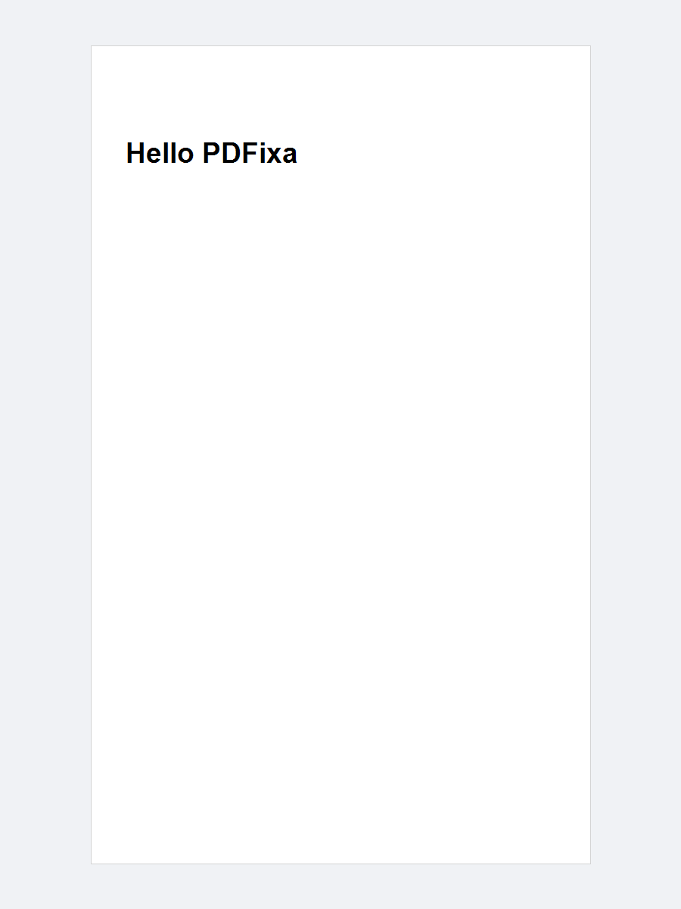

# hello-world

The minimal starting point for PDFixa.
Creates a single-page PDF with two lines of text — nothing more.

---

## Concepts demonstrated

- Creating a `PdfDocument` and adding a `PdfPage`
- Drawing text with `drawTextBox(x, y, width, height, font, fontSize, text)`
- Saving the document to a file with `doc.save(outputStream)`

---

## How to run

```bash
mvn -pl hello-world exec:java -Dexec.mainClass="example.HelloWorldExample"
```

---

## Expected output

```
Saved: hello.pdf
```

File created: `hello-world/hello.pdf`

---

## Preview


