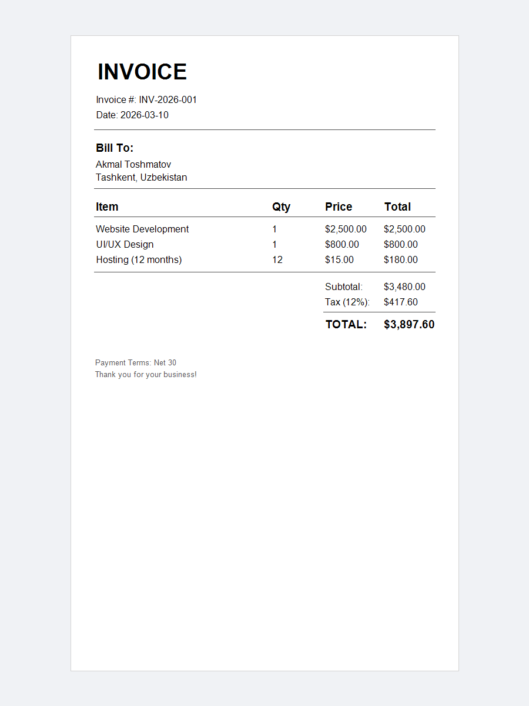

# invoice-generator

A single-page business invoice built with manual coordinate placement.
Shows how to structure a professional document — header, customer block,
line items, and a totals section — using only `drawTextBox` and `ContentStream` lines.

---

## Concepts demonstrated

- Setting PDF metadata with `PdfInfo` (title, author)
- Laying out multi-section content using fixed Y coordinates
- Drawing horizontal divider lines with `ContentStream` (`moveTo` / `lineTo` / `stroke`)
- Formatting a static line-items table with hardcoded values

---

## How to run

```bash
mvn -pl invoice-generator exec:java -Dexec.mainClass="example.InvoiceExample"
```

---

## Expected output

```
Invoice saved to: invoice-output.pdf
```

File created: `invoice-generator/invoice-output.pdf`

---

## Preview


