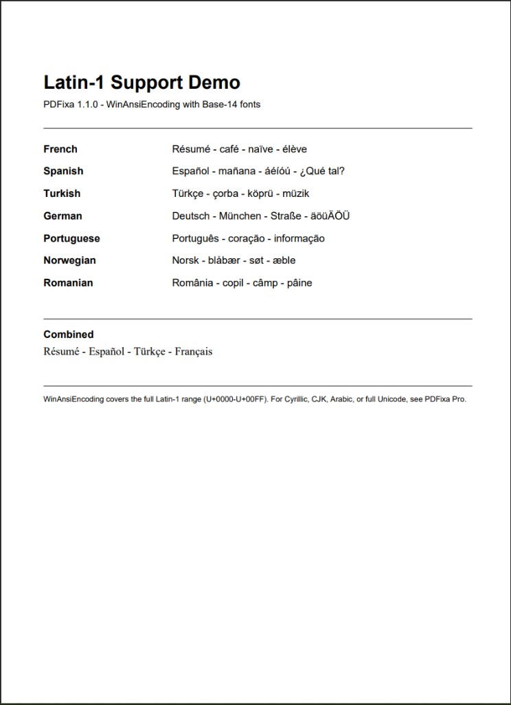

# latin1-demo

Demonstrates Latin-1 text rendering introduced in PDFixa 1.1.0.
Renders accented characters across seven languages using a standard
Base-14 font — no custom font files, no extra configuration.

---

## Concepts demonstrated

- WinAnsiEncoding support in Base-14 fonts (`Helvetica`, `Times-Roman`)
- Rendering the full Latin-1 range (U+0000–U+00FF) with accents and diacritics
- Language coverage: French, Spanish, Turkish, German, Portuguese, Norwegian, Romanian
- Combining multiple languages on a single page
- Embedding Unicode escape sequences (`\uXXXX`) for portable source files

---

## How to run

```bash
mvn -pl latin1-demo exec:java -Dexec.mainClass="example.Latin1Example"
```

---

## Expected output

```
Saved: latin1-example.pdf
```

File created: `latin1-demo/latin1-example.pdf`

---

## Preview



---

## What is covered

WinAnsiEncoding maps to the Latin-1 Supplement block (U+0000–U+00FF),
which covers all major Western European languages.

| Language   | Sample characters        |
|------------|--------------------------|
| French     | é è ê ë â î ï ô ù û ü ÿ |
| Spanish    | ñ á é í ó ú ü ¡ ¿        |
| Turkish    | ç ğ ı ö ş ü              |
| German     | ä ö ü Ä Ö Ü ß            |
| Portuguese | ã â ê ô õ ç              |
| Norwegian  | æ ø å Æ Ø Å              |
| Romanian   | ă â î ș ț                |

For Cyrillic, Arabic, Hebrew, CJK, or full Unicode support, see **PDFixa Pro**.
