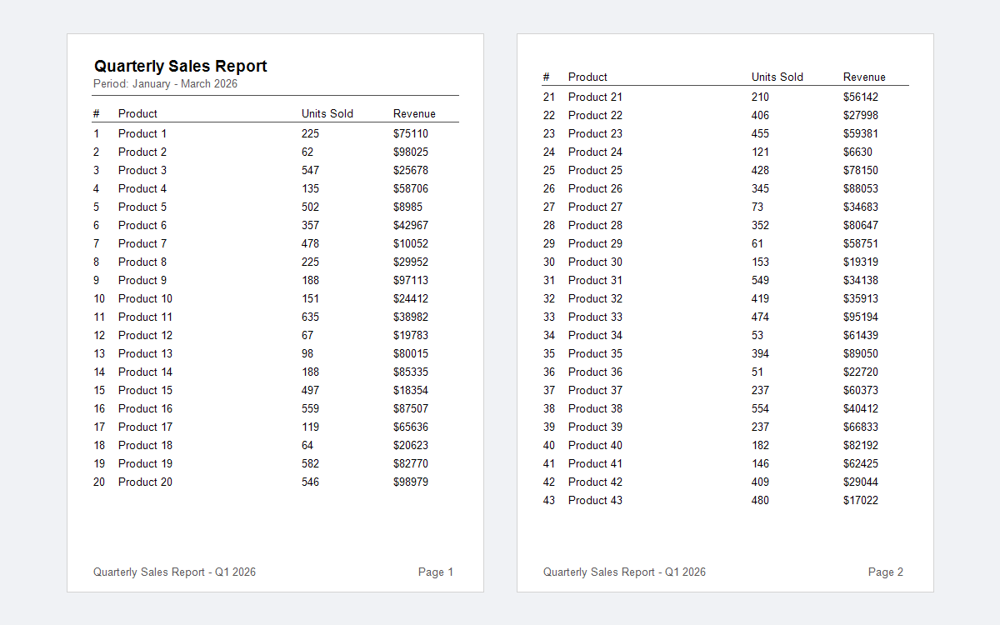

# pagination-table-report

A multi-page quarterly sales report that paginates a 50-row table across pages.
This is the most complete standalone example in the repository — it shows every
technique needed to produce a production-ready paginated document.

---

## Concepts demonstrated

- Detecting page overflow by comparing the current `y` position to a `BOTTOM_MARGIN` constant
- Creating a new `PdfPage` mid-loop when the current page is full
- Repeating the table header on every page with a shared `drawTableHeader()` helper
- Drawing a page footer (report title + page number) on every page via `drawPageFooter()`
- Flushing a closing summary section, with an overflow check before rendering it
- Defining page-layout constants (`PAGE_TOP`, `BOTTOM_MARGIN`, `ROW_HEIGHT`, column positions)
  to keep all coordinate logic in one place

---

## How to run

```bash
mvn -pl pagination-table-report exec:java -Dexec.mainClass="example.PaginationTableReportExample"
```

---

## Expected output

```
Report saved to: pagination-table-report-output.pdf (3 pages)
```

File created: `pagination-table-report/pagination-table-report-output.pdf`

---

## Preview


