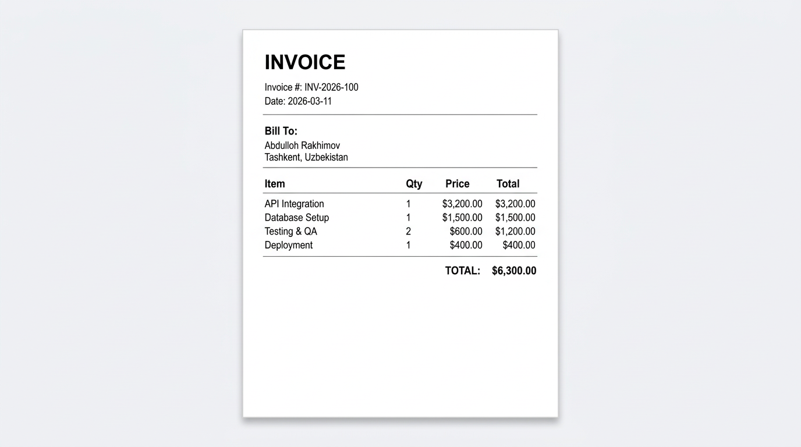

# spring-boot-download

A Spring Boot web application that generates a PDF on request and streams it
directly to the HTTP response — no temporary file, no disk I/O.

---

## Concepts demonstrated

- Writing a PDF to an `HttpServletResponse` output stream instead of a file
- Setting the `Content-Type` header to `application/pdf`
- Setting the `Content-Disposition` header to trigger a browser download
- Generating the document inside a `@GetMapping` handler method
- Building a table layout inline inside a REST controller

---

## How to run

Start the application:

```bash
mvn -pl spring-boot-download spring-boot:run
```

Then download the invoice from another terminal or a browser:

```bash
curl http://localhost:8080/api/reports/invoice -o invoice.pdf
```

---

## Expected output

The server starts on port 8080.
A `GET /api/reports/invoice` request returns a PDF file download named `invoice.pdf`.

---

## Preview


