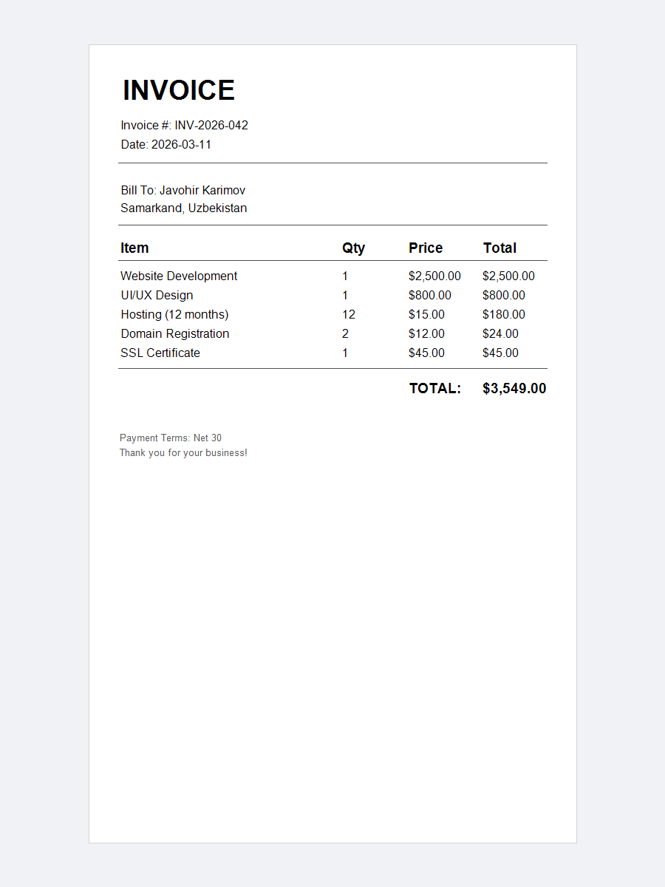

# table-invoice

A business invoice driven by a data list.
Line items are defined as objects and rendered in a loop,
so adding or removing items requires no coordinate adjustments.

---

## Concepts demonstrated

- Modelling document data with an inner `InvoiceItem` class
- Rendering a dynamic table by iterating a `List` and advancing `y` per row
- Calculating totals programmatically (`qty × price`)
- Formatting currency values with `String.format("$%,.2f", amount)`
- Using named column constants (`colItem`, `colQty`, `colPrice`, `colTotal`) instead of magic numbers

---

## How to run

```bash
mvn -pl table-invoice exec:java -Dexec.mainClass="example.TableInvoiceExample"
```

---

## Expected output

```
Invoice saved to: invoice-table.pdf
```

File created: `table-invoice/invoice-table.pdf`

---

## Preview


