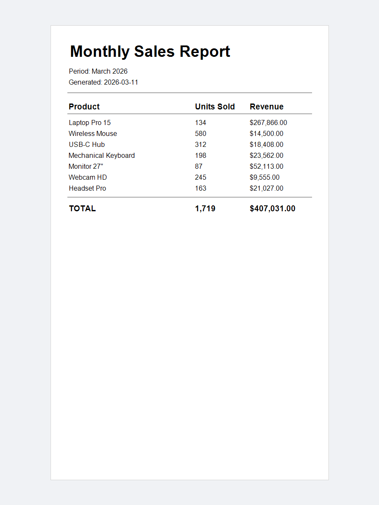

# table-report

A data-driven analytics report with a summary table.
Product rows are defined as a list and rendered in a loop,
with totals accumulated and printed in a bold summary row.

---

## Concepts demonstrated

- Modelling report data with an inner `SalesRow` class
- Rendering a table from a `List` by incrementing `y` per row
- Accumulating column totals inside the render loop
- Printing a bold TOTAL row after the last data row
- Using `String.format("%,d", units)` for thousands-separated integers

---

## How to run

```bash
mvn -pl table-report exec:java -Dexec.mainClass="example.TableReportExample"
```

---

## Expected output

```
Report saved to: sales-report.pdf
```

File created: `table-report/sales-report.pdf`

---

## Preview


